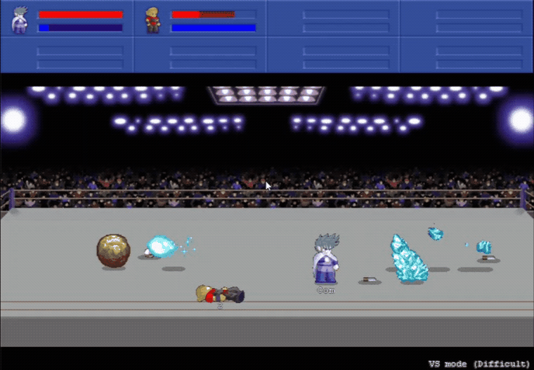
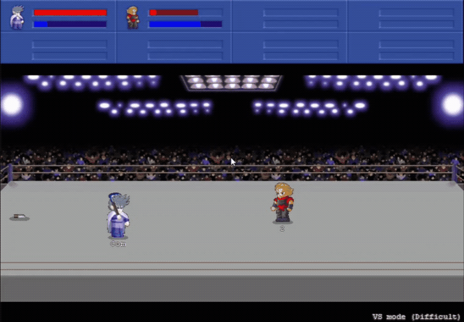

# LF2_RL
A testing little fighter gym simulator for reinforcement learning studying.

## Demo




## Installation
1. Install [OpenAI Gym](https://github.com/openai/gym) and its dependencies.
```
pip install gym
```
2. Download and install [LF2_RL](https://github.com/GdoongMathew/LF2_RL)
```
git clone https://github.com/GdoongMathew/LF2_RL.git
cd LF2_RL
python setup.py install
```

## Running
```python
import gym

def main():

    lf2_env = gym.make('LittleFighter2-v0')
    lf2_env.reset()

    done = False
    while not done:
        obs, reward, done, info = lf2_env.step(lf2_env.action_space.sample())
        if done:
            lf2_env.reset()
    
    lf2_env.close()

if __name__ == '__main__':
    main()
```

## Action Space
Value | Action | Value | Action
--- | --- | --- | ---
0 | idle    | 8 | run
1 | up      | 9 | combo attack1
2 | down    | 10| combo attack2
3 | left    | 11| combo attack3
4 | right   | 12| combo attack4
5 | A       | 13| combo attack5
6 | J       | 14| combo attack6
7 | D

## Observation Space
Mode | Ob space
---|---
picture| [img_h, img_w, number of stacks]
info|[my mp, my hp, my x, my y, my z, enemy1 x, enemy1 y, enemy1 z]
mix | dict(Game_Screen: picture, Info: info)

## Parameters
Parameter|Description|Default Value
---|---|---
windows_name|window's name|'Little Fighter 2'
player_id|AI player id| 1
down_scale|screenshot downscale| 2
frame_stack| number of frames to stack| 4
frame_skip| number of frames to skip between each frame| 1
reset_skip_sec|immortal time when each round begins| 2
mode| observation mode| 'mix'


## Notice
*  Before training/testing, setup your gamemode to "VS Mode" and select your character first.
* Please ALWAYS put lf2 windows on top, otherwise you may result in random words typed in your focused window.(May be fixed in future updates.)

## Multi-Agent (in-window 4-player) Environment
Little Fighter 2 hosts up to **4 human-controllable player slots in a single
window**. Because the env relies on global screen capture + focused-window
keyboard input, `SubprocVecEnv` is impractical here. Instead, the 4 in-window
slots are exposed as **4 independent agents that share one centrally-trained
policy** — giving ~4x experience per window with no extra processes.

This is implemented as a [PettingZoo](https://pettingzoo.farama.org) `ParallelEnv`:

```python
from lf2_gym.lf2_envs.parallel_env import Lf2ParallelEnv

env = Lf2ParallelEnv(player_ids=(0, 1, 2, 3), mode="mix")
obs, infos = env.reset()
actions = {agent: env.action_space(agent).sample() for agent in env.agents}
obs, rewards, terms, truncs, infos = env.step(actions)
```

The shared screen image (`Game_Screen`) is identical for all agents, while each
agent's `Info` array and reward are agent-centric (the acting player listed
first). All game I/O is owned by a single shared `Lf2GameController`, which both
the single-agent `Lf2Env` and the multi-agent `Lf2ParallelEnv` delegate to.

Install the extra: `pip install -e .[multiagent]`.

## Distributed Async Training (DGX learner + Windows actors)
LF2 only runs on Windows, but a GPU server (e.g. **DGX10**, Linux) can't run the
game. Training therefore uses a distributed **actor–learner** split built on
[Ray RLlib](https://docs.ray.io/en/latest/rllib/) (APPO / IMPALA async):

* **Windows machines** run LF2 + rollout `EnvRunner`s (the actors), each yielding
  4 agents' experience per window via the shared policy.
* **The DGX10** is the Ray head and runs the **learner** on the GPU.
* Experience streams from actors to the learner; fresh weights are broadcast back
  asynchronously.

```
   Windows (LF2, EnvRunner x4 agents) ──exp──►  DGX10 (Ray head + GPU learner)
                       ◄──────────── weights broadcast ──────────────
```

Quickstart (see [`lf2_rl/rllib/cluster/README.md`](lf2_rl/rllib/cluster/README.md)
for the full cluster walkthrough):

```bash
pip install -e .[rl]

# On the DGX (head + GPU learner):
NUM_GPUS=1 ./lf2_rl/rllib/cluster/dgx_head.sh 6379

# On each Windows LF2 machine (LF2 running, VS Mode, window focused):
#   .\lf2_rl\rllib\cluster\windows_worker.ps1 -HeadAddress <DGX_IP>:6379

# Launch training on the DGX head:
python -m lf2_rl.rllib.train --address auto --algo appo \
    --num-env-runners <num_windows> --lf2-window-resource \
    --num-learners 1 --num-gpus-per-learner 1 --player-ids 0 1 2 3
```

For a single-machine smoke test (one window, no cluster):

```bash
python -m lf2_rl.rllib.train --num-env-runners 1 --num-gpus-per-learner 0
```
